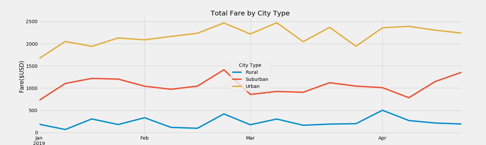

# PyBer Analysis Report

## Background and Results

### Purpose
The purpose of the analysis is to gain insights over key metrics of each city type such as total rides, total drivers, total fares, average fare per ride and average fare per Driver; and analyze the trending of weekly fare in the period of Jan 1st, 2019 to Apr 28th, 2019.
### Technical Analysis
In deriving the analyses, the original source data files are combined into a single dataframe. Using Groupby() feature in pandas, the total rides, total drivers, total fares are first calculated. Average fare per ride and average fare per driver are subsequently calculated using the total fare divided by the total ride and total driver respecitvely. In order to analyze the trending for weekly total fare for each city type, the data set was grouped into weekly sum using the resample().sum() method; and then a plot chart is generated using the weekly data.
### Results
The results of the analyses are presented in the summary table and graph shown below.

### Summary
The summary table indicates that the urban cities have the largest amount total drivers who provided the highest amount of total rides, which in turn generated the highest total fares among the 3 city types. However, the average fare per ride and average fare per driver are both the highest for rural cities.
As for the weekly fare trending, all city types show a fare spike at the end of February. 
## Challenges Encountered and Overcome

### Challenges and Difficulties Encountered

* Programming
Creating the series using groupby() method by date and by city type is 
* Data analysis
Grouping the data by week using the resample("W) method with the realization that resample ("7D") did not generate the same results
* Graphing, etc
Applying the df.plot() function
### Technical Analyses Used
Along the process, each of the above point represents a challenges encounted that prevent the analyses from generating the expected results and/or table. To address these difficulties and challenges, I utilized general Google search, reviewed official documentation, and refered to example coding and question and answers from forum such as stackoverflow in order to gain an understanding of the function and method that I'm not familiar with.
## Recommendations and Next Steps
I highly recommend the company to continue focusing on attracting additional customer base to boost overall ridership. This is especially important for Urban locations the company serves. Further, the company should research the key drivers leading the different level of average fare per ride and average fare per driver among different city types. This will help the company to establish a strategy to properly pricing the fare to stimulate demands.
### Recommendations for Future Analysis

### Additional Analysis 1

In order to further analyze the fares for the rides, we should consider to analyze the fare on a per minute or per mile basis. In order to perform this analysis, we will need to incorporate the duration and distance for each ride into the dataset. The fare per mile and fare per minute can be calculated off the data and the average of such measures can provide insights for future pricing strategy for each city type.

### Additional Analysis 2

We should consider to recreate the result using only the active drivers. I believe based on currently data, the rider count may include any inactive drivers. Therefore, we should introduce the driver ID into the ride dataset and for the total driver count and only count the number of drivers provided the ride. Or we can consider to generate separate driver data set with their activity level to only consider those drivers providing a minimum of X number of rides in the past Y number of days as active driver. This will provide more accurate result for when the calculation requires the driver count to be considered.
